# Project Description
This project is a homework assignment to teach how to get Pycharm setup with Docker, Flask, MySQL, and Postman

## Database Screenshot
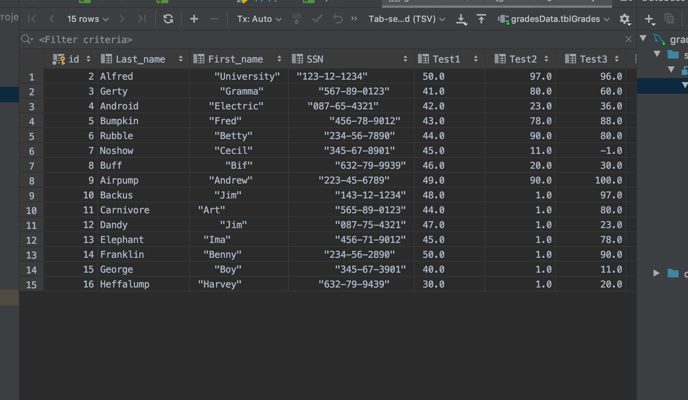

## Browser Screenshot
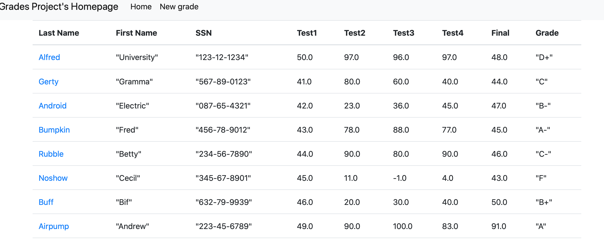

## One Record Screenshot

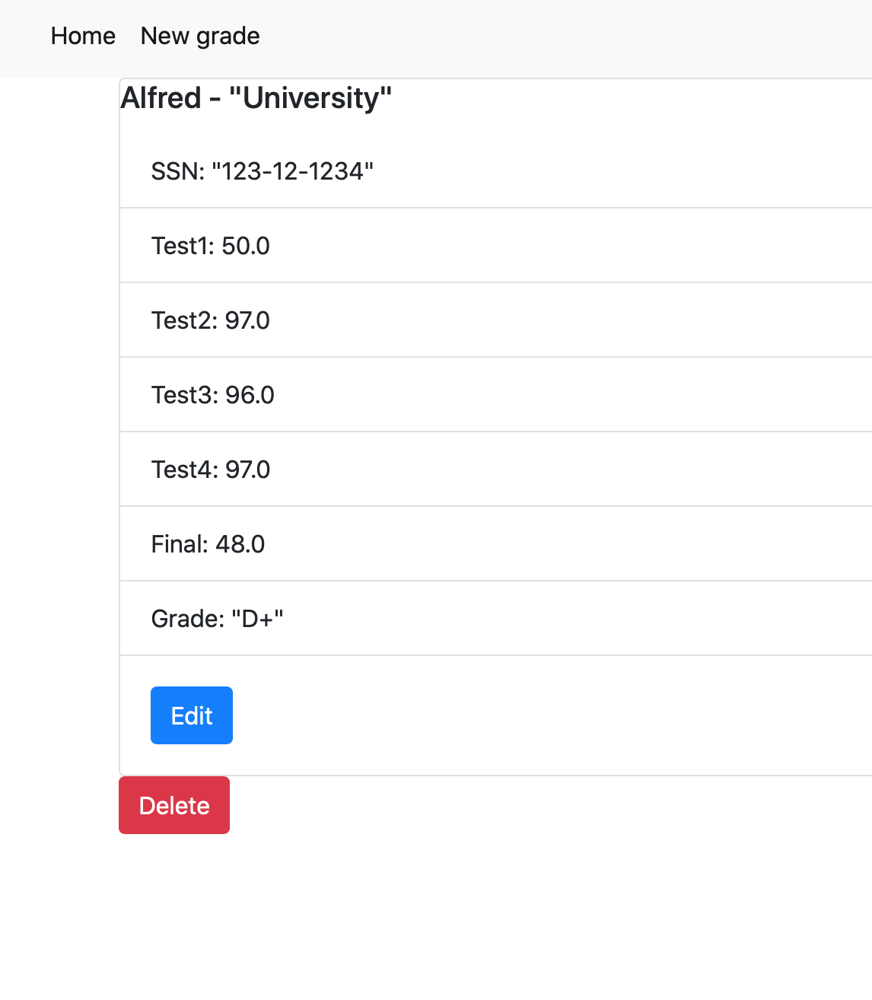

## New Record Screenshot
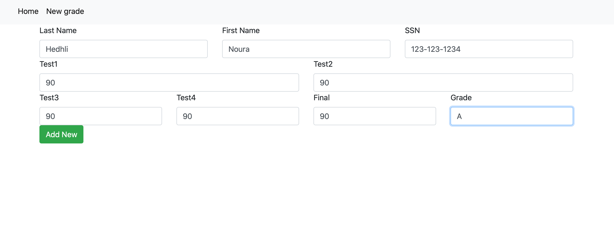

### Result
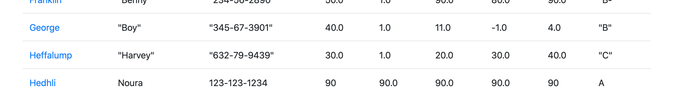

## Edited Screenshot
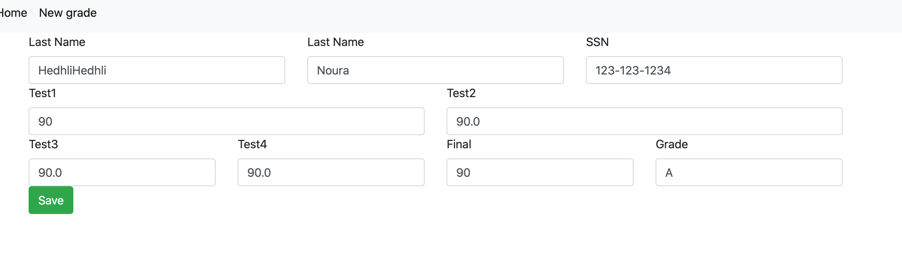

### Result 
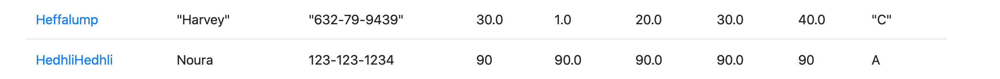

## Delete Screenshot
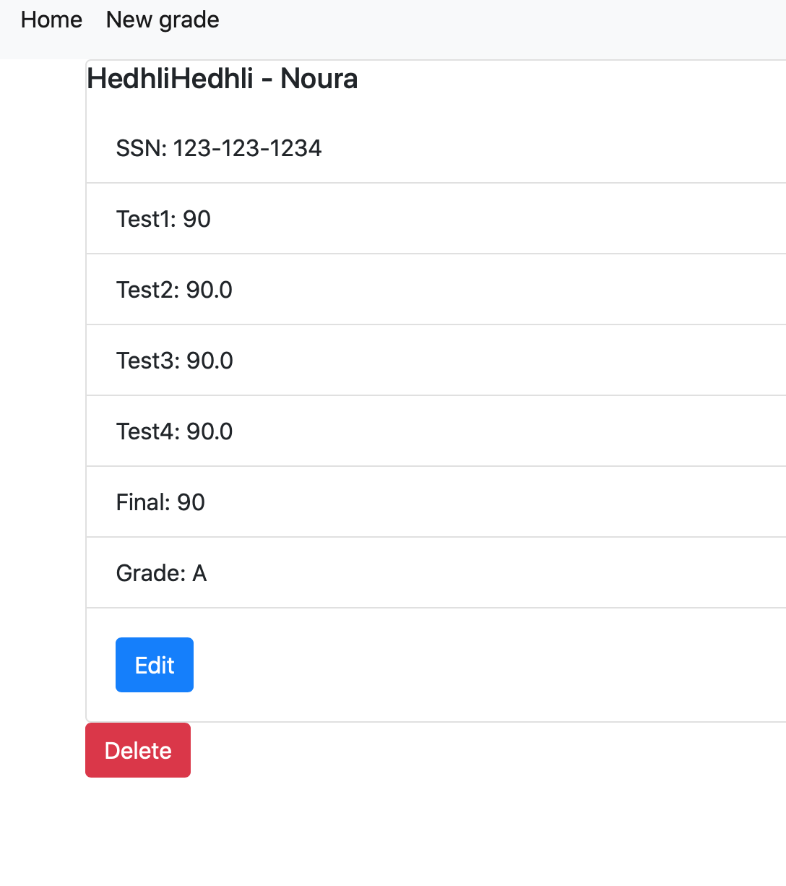

### Result
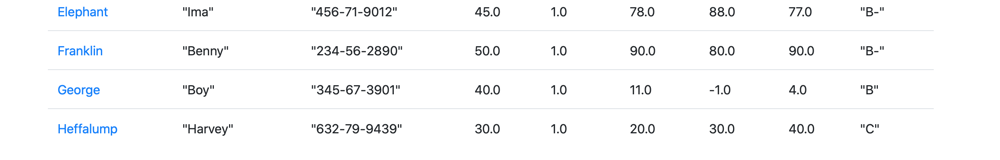

# Postman ScreenShots

## Postman Listing
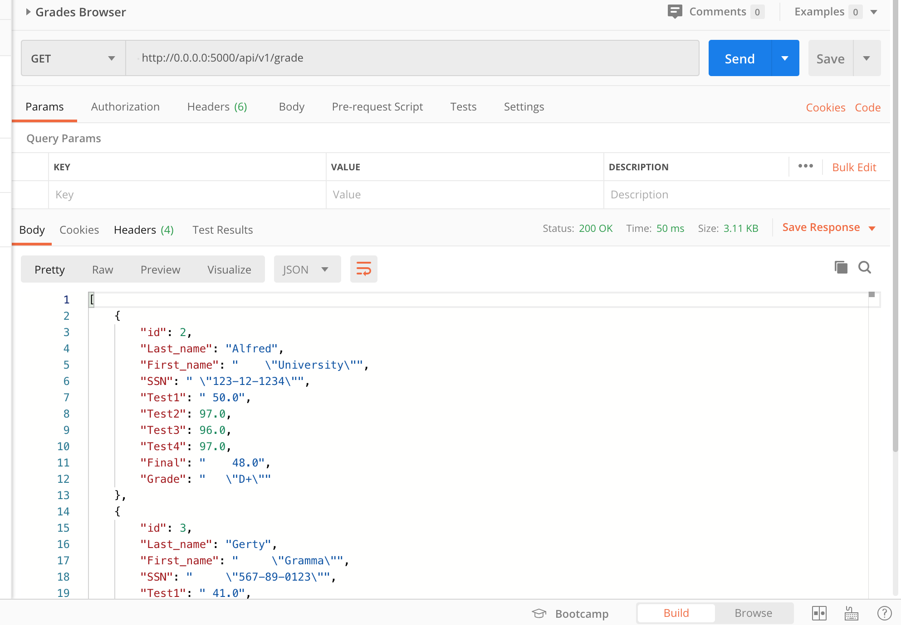

## Postman Post
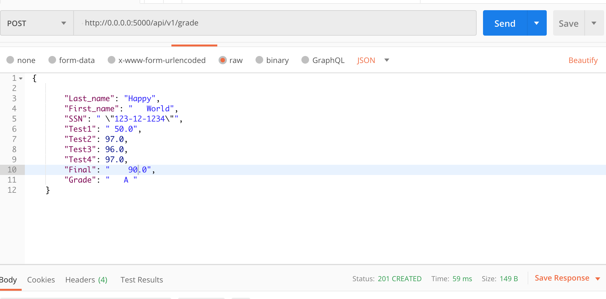

### Result 
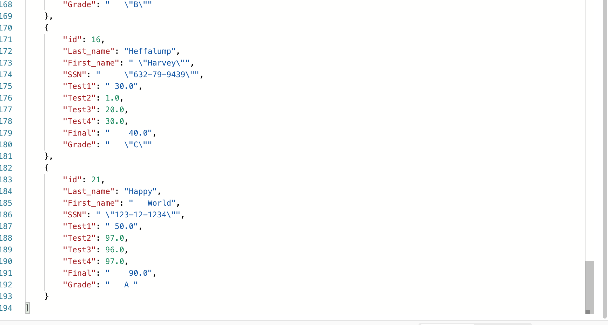

## Postman Put   (Grade from A  to an F )
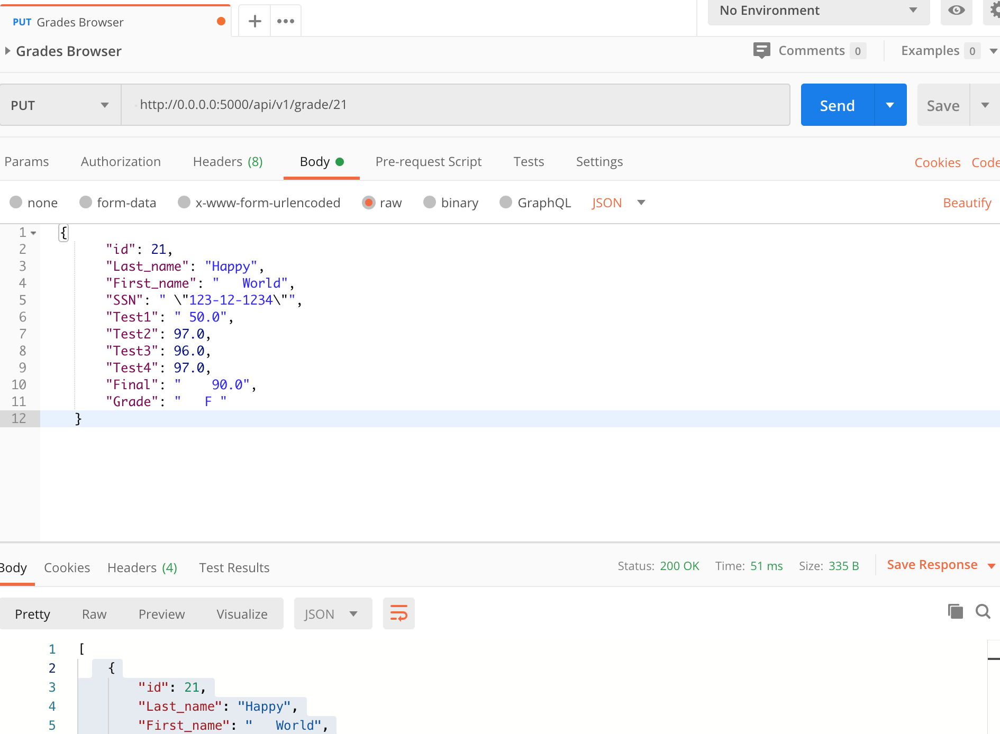

### Result  (Grade from A  to an F )
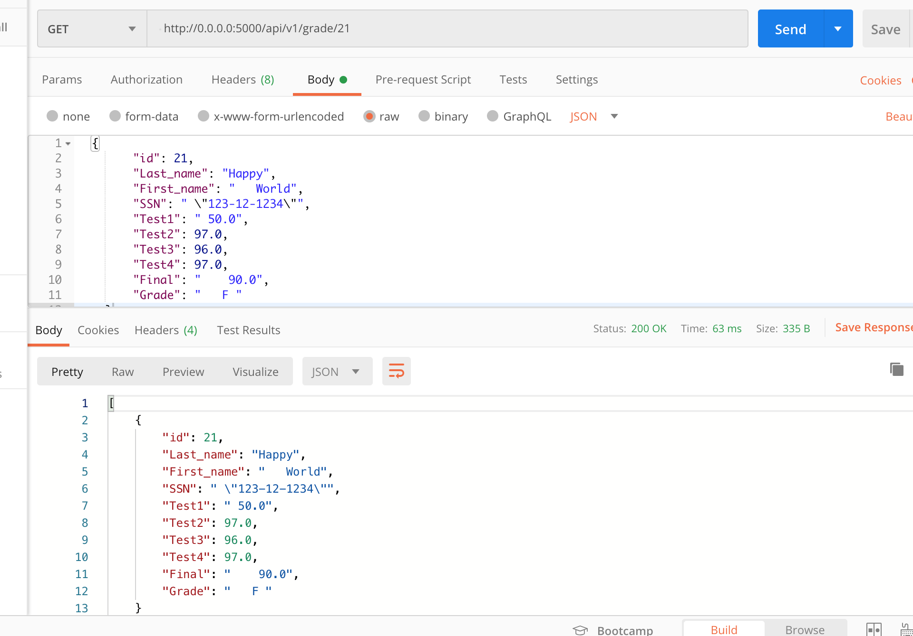

## Postman Delete

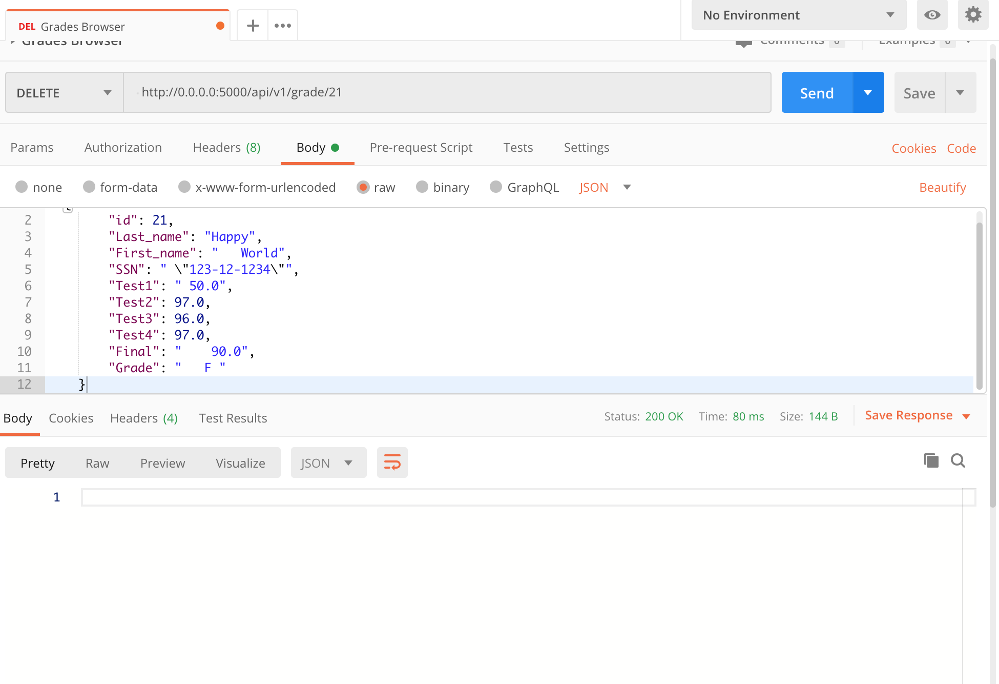

### Result
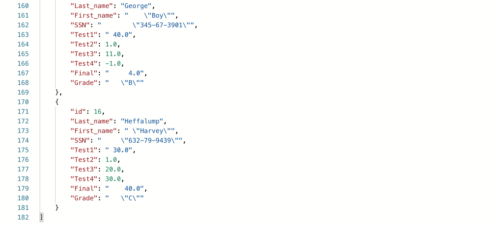